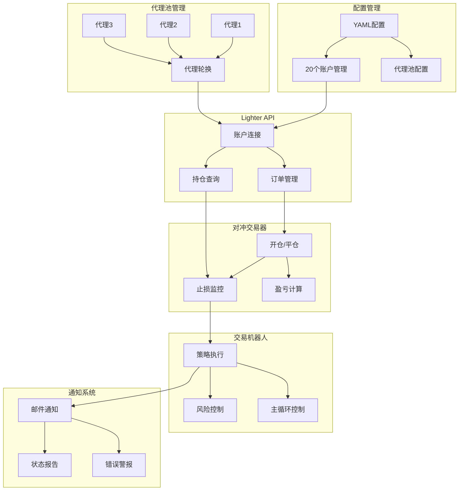
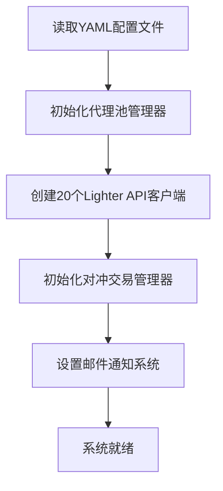
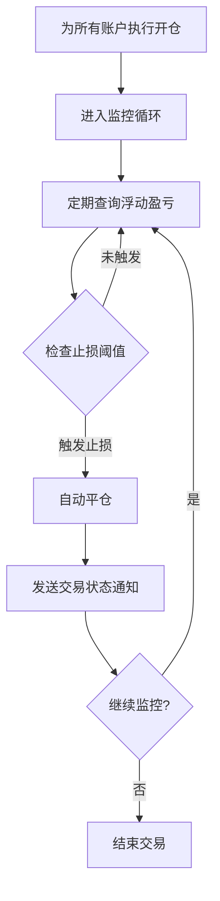
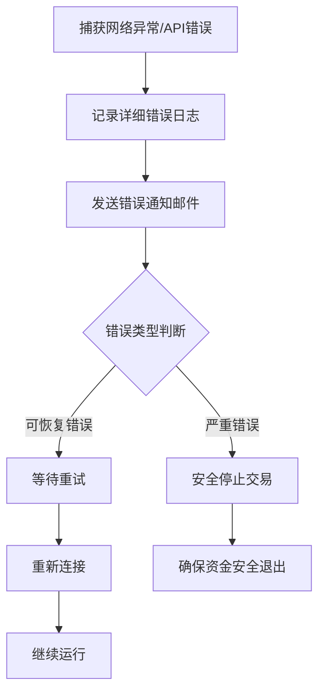
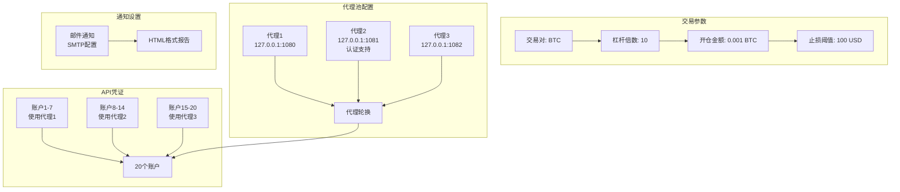
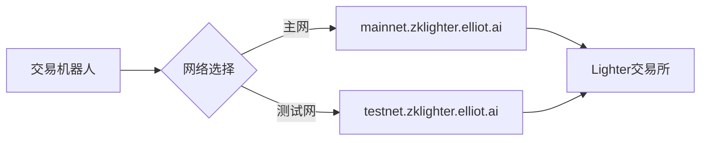
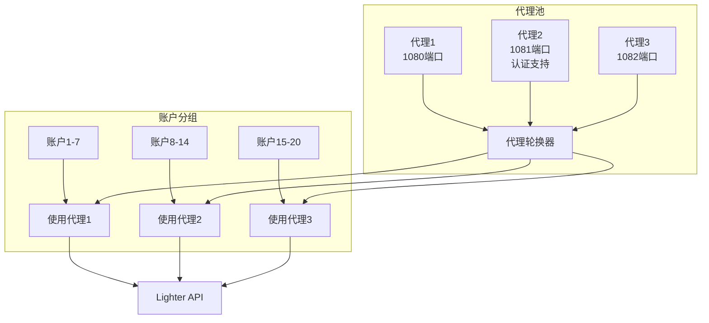
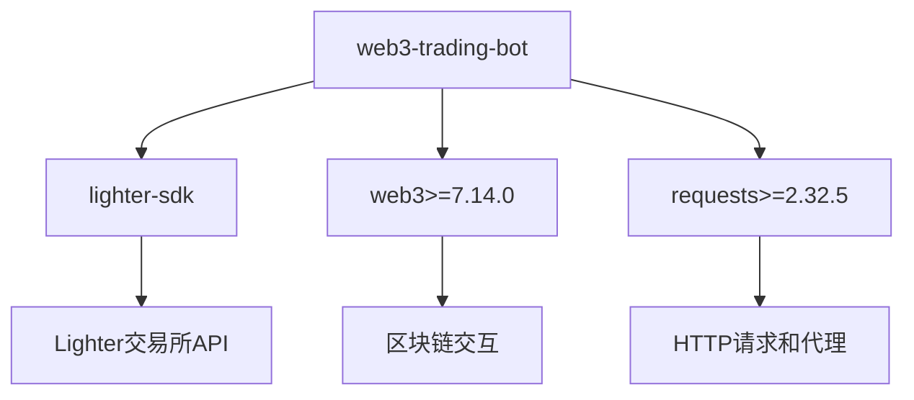

# 对冲交易机器人架构设计文档

## 1. 概述

对冲交易机器人是一个基于Lighter交易所API的自动化交易系统，支持多账户轮换和代理池管理。该系统通过配置化的方式管理20个交易账户，使用代理池分散交易请求，实现风险可控的自动化交易。

## 2. 系统架构

### 2.1 整体架构



### 2.2 模块划分

1. **配置管理模块** (`config_manager.py`)
   - 负责读取和验证YAML配置文件
   - 管理20个交易账户凭证
   - 提供代理池配置访问
   - 验证配置完整性

2. **Lighter API模块** (`lighter_api.py`)
   - 封装Lighter SDK接口
   - 支持HTTP代理轮换
   - 多账户连接管理
   - 订单创建、查询和取消
   - 余额和仓位查询

3. **对冲交易模块** (`hedge_trader.py`)
   - 管理交易对和仓位
   - 执行开仓和平仓操作
   - 实时监控浮动盈亏
   - 自动止损执行
   - 仓位大小计算

4. **通知模块** (`notification.py`)
   - SMTP邮件通知系统
   - 交易状态报告
   - 错误警报发送
   - 支持HTML格式邮件

5. **主控模块** (`trading_bot.py`)
   - 协调各模块工作流程
   - 策略调度和执行
   - 异常处理和恢复
   - 主循环控制

## 3. 数据流设计

### 3.1 初始化流程



### 3.2 交易流程



### 3.3 异常处理流程



## 4. 配置设计

### 4.1 配置文件结构



```yaml
# 交易参数
trading_pair: "BTC"           # 交易对
leverage: 10                  # 杠杆倍数
position_size: 0.001          # 开仓金额(BTC)
stop_loss_threshold: 100      # 止损阈值(USD)

# 代理池设置 (3个代理轮换)
proxy_pool:
  - name: "proxy_1"
    host: "127.0.0.1"
    port: 1080
  - name: "proxy_2"
    host: "127.0.0.1"
    port: 1081
    username: "proxy_user_2"
    password: "proxy_password_2"
  - name: "proxy_3"
    host: "127.0.0.1"
    port: 1082

# 通知设置
notification:
  email:
    enabled: false
    smtp_server: "smtp.gmail.com"
    smtp_port: 587
    sender: "your_email@gmail.com"
    recipient: "recipient@gmail.com"
    username: "your_email@gmail.com"
    password: "your_app_password"

# API凭证 (20个账户配置)
api_credentials:
  - account_name: "account_1"
    api_key: "your_private_key_1"
    account_index: 0
    api_key_index: 0
    network: "mainnet"
    proxy: "proxy_1"
  - account_name: "account_2"
    api_key: "your_private_key_2"
    account_index: 0
    api_key_index: 0
    network: "mainnet"
    proxy: "proxy_2"
  # ... 共20个账户，轮换使用3个代理
```

## 5. 网络配置

### 5.1 API端点



系统基于Lighter SDK，支持以下网络类型：
- **主网**: `https://mainnet.zklighter.elliot.ai`
- **测试网**: `https://testnet.zklighter.elliot.ai`

### 5.2 代理池支持



系统支持HTTP代理池配置：
- 3个代理服务器轮换使用
- 支持认证代理（用户名/密码）
- 20个账户分散使用不同代理
- 避免单点限制和IP封禁

### 5.3 依赖管理



项目使用uv包管理器，主要依赖：
- `lighter-sdk`: Lighter交易所API
- `web3>=7.14.0`: 区块链交互
- `requests>=2.32.5`: HTTP请求和代理支持

## 6. 核心特性

### 6.1 多账户管理
- 支持20个交易账户同时操作
- 代理池关联分配，避免单点限制
- 账户凭证集中管理

### 6.2 风险管理
- 可配置止损阈值（USD）
- 杠杆倍数控制（1-100倍）
- 仓位大小限制（BTC）
- 实时浮动盈亏监控

### 6.3 代理池轮换
- 3个HTTP代理服务器轮换
- 支持认证代理
- 请求分散化，提高稳定性

### 6.4 通知系统
- SMTP邮件通知
- HTML格式状态报告
- 错误警报和交易确认

## 7. 安全设计

1. **API密钥保护**：私钥存储在配置文件中，建议设置文件权限保护
2. **代理支持**：HTTP代理增强网络匿名性
3. **错误处理**：完善的异常处理机制，防止资金损失
4. **日志记录**：详细的交易和错误日志

## 8. 扩展性设计

1. **模块化设计**：各功能模块解耦，便于独立开发和测试
2. **配置驱动**：通过YAML配置文件控制所有参数
3. **插件化通知**：支持多种通知方式，易于扩展
4. **账户可扩展**：支持更多账户和代理配置