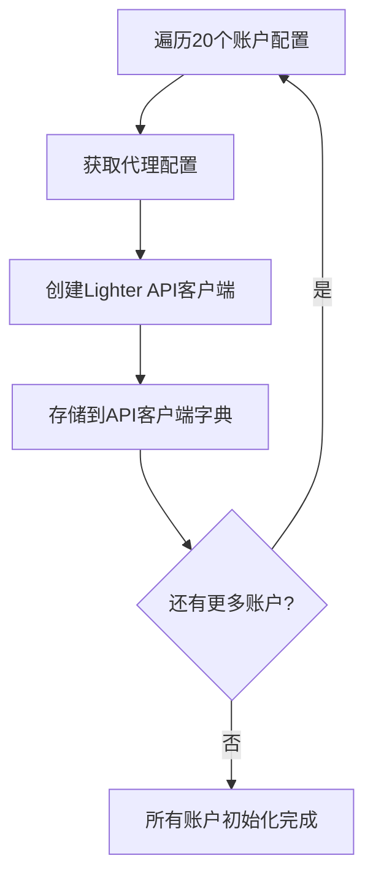
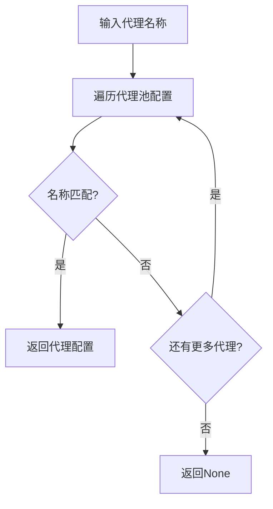
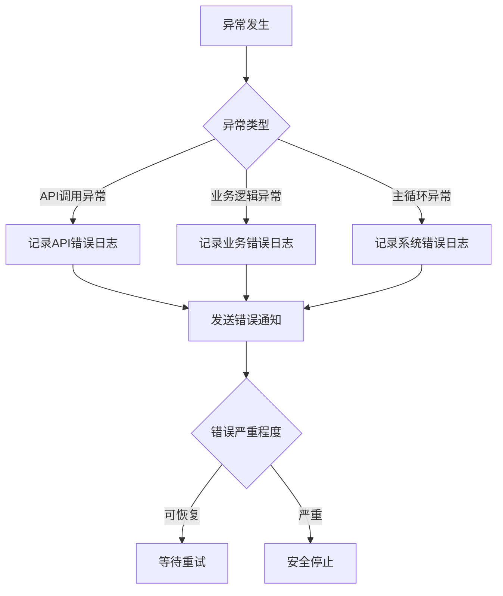
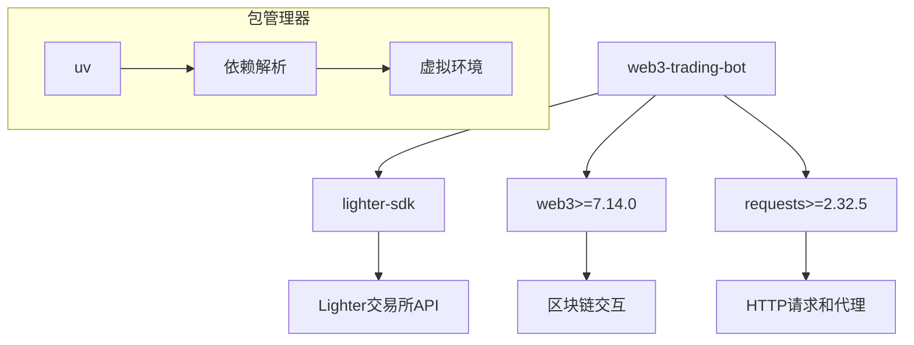
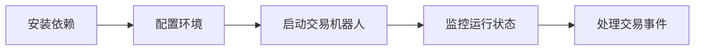

# 对冲交易机器人实现细节文档

## 1. 配置管理模块实现

### 1.1 配置文件读取

配置管理模块使用PyYAML库读取YAML格式的配置文件，支持20个账户和代理池管理：

```python
def load_config(config_path='config.yaml'):
    """
    加载配置文件
    
    Args:
        config_path (str): 配置文件路径
        
    Returns:
        dict: 配置信息字典
    """
    if not os.path.exists(config_path):
        raise FileNotFoundError(f"配置文件 {config_path} 不存在")
    
    with open(config_path, 'r', encoding='utf-8') as file:
        config = yaml.safe_load(file)
    
    # 验证必要配置项
    required_keys = ['trading_pair', 'leverage', 'position_size', 'stop_loss_threshold', 'proxy_pool', 'api_credentials']
    for key in required_keys:
        if key not in config:
            raise ValueError(f"配置文件缺少必要的配置项: {key}")
    
    # 验证代理池配置
    if not config['proxy_pool']:
        raise ValueError("代理池配置不能为空")
    
    # 验证API凭证数量
    if len(config['api_credentials']) < 1:
        raise ValueError("至少需要提供1个API凭证")
    
    # 验证每个API凭证是否包含必要的字段
    for i, credential in enumerate(config['api_credentials']):
        required_credential_keys = ['account_name', 'api_key', 'account_index', 'api_key_index', 'network']
        for key in required_credential_keys:
            if key not in credential:
                raise ValueError(f"第{i+1}个API凭证缺少必要的配置项: {key}")
        
        # 验证网络类型
        if credential['network'] not in ['mainnet', 'testnet']:
            raise ValueError(f"第{i+1}个API凭证的网络类型不支持: {credential['network']}，仅支持 'mainnet' 或 'testnet'")
    
    return config
```

## 2. API客户端模块实现

### 2.1 HTTP代理支持

API客户端通过lighter-sdk库实现HTTP代理支持，支持认证代理：

```python
def _initialize_client(self):
    """初始化Lighter客户端"""
    if self.client is not None:
        return
        
    try:
        # 创建配置对象
        config = lighter.Configuration(host=self.base_url)
        
        # 设置代理（如果配置了代理）
        if self.proxy_config:
            proxy_url = f"http://{self.proxy_config['host']}:{self.proxy_config['port']}"
            
            # 支持认证代理
            if 'username' in self.proxy_config and 'password' in self.proxy_config:
                proxy_url = f"http://{self.proxy_config['username']}:{self.proxy_config['password']}@{self.proxy_config['host']}:{self.proxy_config['port']}"
            
            config.proxy = proxy_url
            logger.info(f"设置代理: {proxy_url}")
        
        # 创建API客户端
        api_client = lighter.ApiClient(configuration=config)
        
        # 创建SignerClient，使用配置文件中的账户索引和API密钥索引
        self.client = lighter.SignerClient(
            url=self.base_url,
            private_key=self.api_key,
            account_index=self.account_index,
            api_key_index=self.api_key_index
        )
        
        # 设置代理（如果需要）
        if self.proxy_config:
            proxy_url = f"http://{self.proxy_config['host']}:{self.proxy_config['port']}"
            
            # 支持认证代理
            if 'username' in self.proxy_config and 'password' in self.proxy_config:
                proxy_url = f"http://{self.proxy_config['username']}:{self.proxy_config['password']}@{self.proxy_config['host']}:{self.proxy_config['port']}"
            
            self.client.api_client.configuration.proxy = proxy_url
            
        logger.info(f"Lighter客户端初始化成功 (账户索引: {self.account_index}, API密钥索引: {self.api_key_index})")
    except Exception as e:
        logger.error(f"Lighter客户端初始化失败: {str(e)}")
        raise
```

### 2.2 API端点配置

根据网络类型设置正确的API端点，不支持直接指定URL：

```python
def __init__(self, api_key, network='mainnet', proxy_config=None, account_index=0, api_key_index=0):
    self.api_key = api_key
    self.network = network
    self.account_index = account_index
    self.api_key_index = api_key_index
    
    # 根据网络设置基础URL，不支持直接指定URL
    if network == 'mainnet':
        self.base_url = "https://mainnet.zklighter.elliot.ai"
    elif network == 'testnet':
        self.base_url = "https://testnet.zklighter.elliot.ai"
    else:
        raise ValueError(f"不支持的网络类型: {network}，仅支持 'mainnet' 或 'testnet'")
```

## 3. 对冲交易模块实现

### 3.1 交易账户管理

对冲交易模块管理所有账户，支持单账户和多账户操作：

```python
def _create_traders(self):
    """创建交易器实例"""
    api_credentials = self.config['api_credentials']
    
    # 为每个账户创建交易器
    for credential in api_credentials:
        trader = HedgeTrader(credential, self.config)
        self.traders.append(trader)
```

### 3.2 开仓实现

为每个账户执行开仓操作：

```python
def open_position(self):
    """
    开仓建立头寸
    """
    try:
        # 下单建立头寸
        self.order = self.api.place_order(
            symbol=self.symbol,
            side='buy',  # 统一做多方向
            price=None,  # 市价单
            quantity=self.position_size,
            leverage=self.leverage
        )
        
        return True
    except Exception as e:
        logger.error(f"开仓失败 {self.account_name}: {str(e)}")
        return False
```

### 3.3 浮动盈亏监控

通过获取持仓信息计算每个账户的浮动盈亏：

```python
def get_floating_pnl(self):
    """
    获取浮动盈亏
    """
    try:
        # 获取账户的持仓信息
        positions = self.api.get_open_positions(symbol=self.symbol)
        
        # 计算浮动盈亏
        total_pnl = 0
        
        if positions and 'positions' in positions:
            for position in positions['positions']:
                if position.get('symbol') == self.symbol:
                    total_pnl += position.get('unrealizedPnl', 0)
        
        return total_pnl
    except Exception as e:
        logger.error(f"获取浮动盈亏失败 {self.account_name}: {str(e)}")
        return 0
```

### 3.4 止损检查和平仓

当浮动亏损超过阈值时触发止损并平仓：

```python
def is_stop_loss_triggered(self):
    """
    检查是否触发止损
    """
    floating_pnl = self.get_floating_pnl()
    stop_loss_threshold = self.config['stop_loss_threshold']
    
    # 如果浮动亏损超过阈值，触发止损
    if floating_pnl < -abs(stop_loss_threshold):
        logger.info(f"触发止损 {self.account_name}: 浮动盈亏 {floating_pnl} USD")
        return True
    
    return False

def close_position(self):
    """
    平仓
    """
    try:
        # 平仓头寸
        result = self.api.close_position(
            symbol=self.symbol,
            side='sell'  # 买入的头寸通过卖出平仓
        )
        
        return True
    except Exception as e:
        logger.error(f"平仓失败 {self.account_name}: {str(e)}")
        return False
```

## 4. 通知模块实现

### 4.1 邮件通知

通过smtplib实现HTML格式邮件通知功能：

```python
def send_email(self, subject, message):
    """
    发送邮件通知
    """
    email_config = self.notification_config.get('email', {})
    
    # 检查是否配置了邮件通知
    if not email_config.get('enabled', False):
        return
        
    try:
        # 创建邮件对象
        msg = MIMEMultipart()
        msg['From'] = email_config.get('sender')
        msg['To'] = email_config.get('recipient')
        msg['Subject'] = subject
        
        # 添加HTML格式邮件内容
        html_message = f"""
        <html>
          <body>
            <h2>交易机器人通知</h2>
            <p><strong>主题:</strong> {subject}</p>
            <p><strong>时间:</strong> {datetime.now().strftime('%Y-%m-%d %H:%M:%S')}</p>
            <div style="background-color: #f5f5f5; padding: 15px; border-radius: 5px;">
              <pre>{message}</pre>
            </div>
          </body>
        </html>
        """
        
        msg.attach(MIMEText(html_message, 'html'))
        
        # 连接SMTP服务器并发送邮件
        server = smtplib.SMTP(email_config.get('smtp_server'), email_config.get('smtp_port'))
        server.starttls()
        server.login(email_config.get('username'), email_config.get('password'))
        server.send_message(msg)
        server.quit()
        
        logger.info(f"邮件通知发送成功: {subject}")
    except Exception as e:
        logger.error(f"发送邮件通知失败: {str(e)}")
```

## 5. 主控模块实现

### 5.1 交易循环

主控模块实现交易循环，定期检查所有账户的止损条件：

```python
def _monitor_loop(self):
    """监控循环"""
    logger.info("进入监控循环...")
    
    while self.running:
        try:
            # 检查每个账户是否触发止损
            for trader in self.traders:
                if trader.is_stop_loss_triggered():
                    logger.info(f"账户 {trader.account_name} 触发止损，正在平仓...")
                    
                    # 平仓
                    success = trader.close_position()
                    
                    if success:
                        # 发送通知
                        self.notification_manager.send_notification(
                            "头寸已平仓",
                            f"账户 {trader.account_name} 因触发止损已平仓。"
                        )
            
            # 等待一段时间后继续监控
            time.sleep(30)  # 每30秒检查一次
            
        except KeyboardInterrupt:
            logger.info("收到停止信号，正在停止交易...")
            self.stop_trading()
            break
        except Exception as e:
            logger.error(f"监控循环发生错误: {str(e)}")
            # 发送错误通知
            self.notification_manager.send_notification(
                "监控错误",
                f"监控循环发生错误: {str(e)}"
            )
            # 继续运行而不是停止
            time.sleep(60)  # 出错后等待1分钟再继续
```

## 6. 核心特性实现

### 6.1 多账户轮换



系统支持20个账户轮换操作，通过代理池分散请求：

```python
def initialize_all_accounts(self):
    """初始化所有账户"""
    for credential in self.config['api_credentials']:
        # 获取代理配置
        proxy_name = credential.get('proxy')
        proxy_config = self._get_proxy_config(proxy_name)
        
        # 创建API客户端
        api_client = LighterAPI(
            api_key=credential['api_key'],
            network=credential['network'],
            proxy_config=proxy_config,
            account_index=credential['account_index'],
            api_key_index=credential['api_key_index']
        )
        
        self.api_clients[credential['account_name']] = api_client
```

### 6.2 代理池管理



支持3个代理服务器轮换，避免单点限制：

```python
def _get_proxy_config(self, proxy_name):
    """根据代理名称获取代理配置"""
    for proxy in self.config['proxy_pool']:
        if proxy['name'] == proxy_name:
            return proxy
    return None
```

### 6.3 错误处理和日志记录



系统采用分层异常处理机制：

1. 底层API调用异常处理
2. 业务逻辑异常处理
3. 主循环异常处理

使用Python内置logging模块记录系统运行状态：

```python
import logging

# 配置日志
logging.basicConfig(
    level=logging.INFO,
    format='%(asctime)s - %(name)s - %(levelname)s - %(message)s'
)
logger = logging.getLogger(__name__)
```

日志级别：
- INFO: 一般信息
- WARNING: 警告信息
- ERROR: 错误信息
- DEBUG: 调试信息

## 7. 依赖和部署

### 7.1 依赖管理



项目使用uv包管理器，主要依赖：

```toml
[project]
name = "web3-trading-bot"
version = "0.1.0"
requires-python = ">=3.13"
dependencies = [
    "lighter-sdk",
    "requests>=2.32.5",
    "web3>=7.14.0",
]
```

### 7.2 运行方式



```bash
# 安装依赖
uv sync

# 运行交易机器人
python -m src.trading_bot
```

### 7.3 测试实现

使用unittest框架编写单元测试：

```python
class TestHedgeTradingBot(unittest.TestCase):
    
    @patch('src.config_manager.yaml')
    @patch('src.config_manager.os.path.exists')
    def test_load_config(self, mock_exists, mock_yaml):
        """测试配置文件加载功能"""
        # 设置mock返回值
        mock_exists.return_value = True
        mock_yaml.safe_load.return_value = self.test_config
        
        # 调用函数
        config = load_config('test_config.yaml')
        
        # 验证结果
        self.assertEqual(config, self.test_config)
```

### 7.4 Mock测试

使用unittest.mock对依赖进行模拟：

```python
@patch('src.lighter_api.LighterAPI')
@patch('src.hedge_trader.HedgeTrader')
def test_trader_creation(self, mock_trader, mock_api):
    """测试交易器创建"""
    # 设置mock返回值
    mock_trader_instance = MagicMock()
    mock_trader.return_value = mock_trader_instance
    
    # 创建交易机器人
    bot = TradingBot('config.yaml')
    
    # 验证结果
    self.assertEqual(len(bot.traders), len(self.test_config['api_credentials']))
```